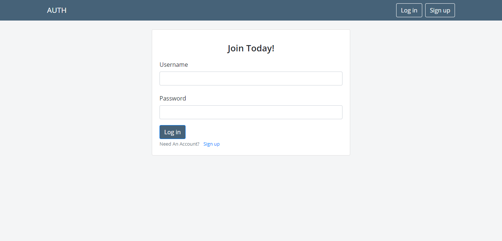

# DjangoAuth-2.0
Having signup,login,profile_photo,set_up_bio,profile_edit,password_change etc.

How to use :
just place the users app in your project, rest of the things the app will do itself. 
(just place the app url by yourself)

#login

#signup

#Profile

